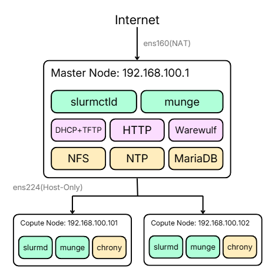

[README (3).md](https://github.com/user-attachments/files/29195356/README.3.md)
# OpenHPC Cluster Installation Guide

> **Best Practice Runbook** — Rocky Linux 9 + OpenHPC 3 + Warewulf + SLURM

[](https://openhpc.community/)
[](https://rockylinux.org/)
[](https://slurm.schedmd.com/)

This runbook provides a step-by-step guide to deploying a fully functional HPC cluster using OpenHPC 3 on Rocky Linux 9, provisioned via Warewulf and managed with SLURM. It is designed for lab and educational environments, with production considerations noted throughout.

---

## Table of Contents

- [Cluster Architecture](#cluster-architecture)
- [Prerequisites](#prerequisites)
- [Phase 1 — Master Node Setup (sms)](#phase-1--master-node-setup-sms)
- [Phase 2 — Compute Node Image](#phase-2--compute-node-image)
- [Phase 3 — Node Registration & Boot](#phase-3--node-registration--boot)
- [Phase 4 — Job Submission Testing](#phase-4--job-submission-testing)
- [Best Practices Summary](#best-practices-summary)

---

## Cluster Architecture



| Node | Hostname | Internal IP | Network / Role |
|------|----------|-------------|----------------|
| Master | `sms` | `192.168.100.1` | `ens224` (internal) + `ens160` (external) — Controller, NFS, DHCP/TFTP, NTP, DB |
| Compute 1 | `cn01` | `192.168.100.101` | PXE-provisioned — runs `slurmd` + `munge` |
| Compute 2 | `cn02` | `192.168.100.102` | PXE-provisioned — runs `slurmd` + `munge` |

> **Design note:** The master node (`sms`) uses two NICs intentionally. The external interface (`ens160`) handles internet access for package downloads, while the internal interface (`ens224`) runs an isolated provisioning network. This separation prevents DHCP conflicts on the main network and ensures PXE always targets the correct interface.

---

## Prerequisites

Verify the following before proceeding. These checks eliminate the most common failure causes:

- [ ] Running as `root` — prompt ends with `#` (run `su -` if still `$`)
- [ ] Internal NIC name is known — run `ip addr` and note the Host-only interface name (this guide uses `ens224`)
- [ ] External NIC has internet access — `ping -c2 8.8.8.8` succeeds (required for package downloads)
- [ ] MAC addresses of both compute VMs are recorded — from VMware → Network Adapter → Advanced
- [ ] Both VMs are set to Host-only networking — same VMnet as `ens224`, with Network listed before Disk in boot order

> **Note:** If your internal interface is not `ens224`, substitute its actual name in every command throughout this guide.

---

## Phase 1 — Master Node Setup (sms)

### 1.1 Base System Configuration

Set a static IP, configure hostname resolution, and disable SELinux/firewall for the lab environment.

```bash
# Set hostname
hostnamectl set-hostname sms

# Assign static IP to the internal NIC
nmcli con show                              # Identify connection tied to ens224
nmcli con mod "Wired connection 1" ipv4.addresses 192.168.100.1/24
nmcli con mod "Wired connection 1" ipv4.method manual
nmcli con up  "Wired connection 1"

# Populate /etc/hosts
cat >> /etc/hosts << 'EOF'
192.168.100.1   sms  sms.local
192.168.100.101 cn01 cn01.local
192.168.100.102 cn02 cn02.local
EOF

# Disable SELinux and firewall (lab only), then update
sed -i 's/^SELINUX=.*/SELINUX=disabled/' /etc/selinux/config
setenforce 0
systemctl disable --now firewalld
dnf update -y
```

> **Production note:** Do not disable SELinux/firewall in production. Use `permissive` mode during installation to collect audit logs, write a proper policy, then open only required ports: munge (6817–6819), NFS, DHCP/TFTP/HTTP.

---

### 1.2 OpenHPC Repository & Base Stack

```bash
dnf install -y http://repos.openhpc.community/OpenHPC/3/EL_9/x86_64/ohpc-release-3-1.el9.x86_64.rpm
dnf install -y epel-release
dnf install -y ohpc-base ohpc-warewulf slurm-slurmctld-ohpc

# Checkpoint: both repos visible
dnf repolist | grep -iE 'ohpc|epel'
```

---

### 1.3 Time Server Configuration

MUNGE uses timestamps to validate credentials — clock skew across nodes will cause all jobs to fail. Configure `sms` as the authoritative NTP source for the cluster.

```bash
echo 'allow 192.168.100.0/24' >> /etc/chrony.conf   # Allow compute nodes to sync
echo 'local stratum 10'       >> /etc/chrony.conf   # Serve time even if upstream is unreachable
systemctl enable --now chronyd

# Checkpoint: source marked with ^* and Reach = 377
chronyc sources -v
```

---

### 1.4 NFS Exports

Share `/home` (user data and job output) and `/opt/ohpc/pub` (OpenHPC modules, read-only).

```bash
cat >> /etc/exports << 'EOF'
/home           192.168.100.0/24(rw,no_subtree_check,no_root_squash)
/opt/ohpc/pub   192.168.100.0/24(ro,no_subtree_check)
EOF

systemctl enable --now nfs-server
exportfs -a
exportfs -v   # Checkpoint: both paths exported to 192.168.100.0/24
```

> **Tip:** Always write job output under `/home` (NFS-shared). Avoid `/root` — it is local to each node and files will be stranded on compute nodes.

---

### 1.5 MUNGE Key Generation

MUNGE is the authentication layer between the controller and compute nodes. Every node must share the same key.

```bash
create-munge-key -f
systemctl enable --now munge

# Checkpoint: STATUS: Success (0)
munge -n | unmunge | grep STATUS
```

---

### 1.6 Warewulf Database (MariaDB)

Warewulf stores node metadata and provisioning images in MariaDB. The `max_allowed_packet` must be increased before building images, as packed images can exceed the 16 MB default.

```bash
# Increase packet limit (prevents image build failures)
cat >> /etc/my.cnf.d/server.cnf << 'EOF'
[mysqld]
max_allowed_packet=1024M
EOF

systemctl enable --now mariadb
wwinit DATABASE

# Checkpoint: wwuser/wwroot present, packet size = 1073741824
mysql -u root -e "SELECT user, host FROM mysql.user;"
mysql -u root -e "SHOW VARIABLES LIKE 'max_allowed_packet';"
```

---

### 1.7 SLURM Configuration

Define the cluster topology and resource parameters. Adjust `Sockets`, `CoresPerSocket`, and `ThreadsPerCore` to match your actual VM specs.

```bash
mkdir -p /etc/slurm
cat > /etc/slurm/slurm.conf << 'EOF'
ClusterName=ohpc
SlurmctldHost=sms
SlurmUser=slurm
StateSaveLocation=/var/spool/slurm/ctld
SlurmdSpoolDir=/var/spool/slurm/d
SwitchType=switch/none
MpiDefault=none
ProctrackType=proctrack/linuxproc
ReturnToService=2

SlurmctldLogFile=/var/log/slurmctld.log
SlurmdLogFile=/var/log/slurmd.log
SlurmctldPidFile=/var/run/slurmctld.pid
SlurmdPidFile=/var/run/slurmd.pid

SchedulerType=sched/backfill
SelectType=select/cons_tres
SelectTypeParameters=CR_Core

# Adjust to match actual VM specs
NodeName=cn[01-02] Sockets=1 CoresPerSocket=2 ThreadsPerCore=1 State=UNKNOWN
PartitionName=normal Nodes=cn[01-02] Default=YES MaxTime=INFINITE State=UP
EOF
```

> **Tip:** Unsure about your VM specs? Boot a compute node and run `slurmd -C` — it prints the correct `NodeName` line ready to copy.

---

### 1.8 Start SLURM Controller

```bash
mkdir -p /var/spool/slurm/ctld /var/spool/slurm/d
chown slurm: /var/spool/slurm/ctld /var/spool/slurm/d
systemctl enable --now slurmctld

# Checkpoint: active (running)
systemctl status slurmctld --no-pager
```

### Phase 1 Checkpoint

Before continuing, verify all of the following:

- `chronyc sources` shows a source marked with `^*`
- `exportfs -v` shows both `/home` and `/opt/ohpc/pub`
- `munge -n | unmunge` returns `STATUS: Success`
- MariaDB has `wwuser`/`wwroot` and `max_allowed_packet = 1073741824`
- `slurmctld` is `active (running)`

---

## Phase 2 — Compute Node Image

### 2.1 Provision Interface & PXE Services

```bash
# Point Warewulf at the internal NIC
perl -pi -e 's/device = eth1/device = ens224/' /etc/warewulf/provision.conf
grep 'network device' /etc/warewulf/provision.conf   # Checkpoint: = ens224

# Enable PXE services (DHCP + TFTP + HTTP)
wwsh dhcp update && wwsh dhcp restart
systemctl enable --now dhcpd tftp.socket httpd
```

---

### 2.2 Build the Compute Node chroot

Create the root filesystem for compute nodes and install all required packages in one pass.

```bash
# Create chroot
wwmkchroot -v rocky-9 /opt/ohpc/admin/images/rocky9

# Copy repository configs into the image
cp /etc/yum.repos.d/OpenHPC.repo /opt/ohpc/admin/images/rocky9/etc/yum.repos.d/
cp /etc/yum.repos.d/epel.repo    /opt/ohpc/admin/images/rocky9/etc/yum.repos.d/

# Install all required packages (job execution + auth + time sync + base tools)
dnf --installroot=/opt/ohpc/admin/images/rocky9 install -y \
    ohpc-base-compute slurm-slurmd-ohpc munge chrony
```

> **Note:** `chrony` is not included in the base image by default — install it explicitly or compute nodes will have clock drift, causing MUNGE authentication failures.

---

### 2.3 Inject Configuration & Lock MUNGE UID

This is the most critical step for preventing MUNGE authentication failures. The `munge` user UID/GID inside the image **must match** the UID/GID on `sms` before copying the key.

```bash
IMG=/opt/ohpc/admin/images/rocky9

# Create target directories and copy configs
mkdir -p $IMG/etc/slurm $IMG/etc/munge
cp /etc/slurm/slurm.conf $IMG/etc/slurm/
cp /etc/munge/munge.key  $IMG/etc/munge/

# Populate /etc/hosts in the image
cat >> $IMG/etc/hosts << 'EOF'
192.168.100.1   sms  sms.local
192.168.100.101 cn01 cn01.local
192.168.100.102 cn02 cn02.local
EOF

# Lock munge UID/GID to match sms (verify with: grep munge /etc/passwd)
chroot $IMG usermod  -u 996 munge
chroot $IMG groupmod -g 995 munge

# Fix ownership and permissions
chroot $IMG chown -R munge:munge /etc/munge /var/log/munge /var/lib/munge /run/munge
chmod 400 $IMG/etc/munge/munge.key
chmod 700 $IMG/etc/munge
```

> **Important:** Verify your actual MUNGE UID/GID with `grep munge /etc/passwd` and `grep munge /etc/group` on `sms`. This guide uses `996`/`995` — update the values if yours differ.

---

### 2.4 Finalize Image Configuration

Complete all remaining image setup before building — this avoids the need for multiple rebuilds.

```bash
IMG=/opt/ohpc/admin/images/rocky9

# SLURM spool directory
mkdir -p $IMG/var/spool/slurm/d
chroot $IMG chown slurm: /var/spool/slurm/d

# Point chrony at sms
echo 'server 192.168.100.1 iburst' >> $IMG/etc/chrony.conf

# Auto-mount /home on boot
echo '192.168.100.1:/home /home nfs defaults 0 0' >> $IMG/etc/fstab
mkdir -p $IMG/home

# Enable all required services
chroot $IMG systemctl enable munge slurmd chronyd
```

---

### 2.5 Build the VNFS Image

With the image fully configured, build it once.

```bash
wwvnfs --chroot /opt/ohpc/admin/images/rocky9

# Checkpoint: SIZE must not be 0.0
wwsh vnfs list
```

### Phase 2 Checkpoint

- `wwsh vnfs list` shows `rocky9` with a non-zero size (expected: hundreds of MB)

---

## Phase 3 — Node Registration & Boot

### 3.1 Register Compute Nodes in Warewulf

```bash
# Register nodes (replace MACs with actual values — no spaces after --hwaddr=)
wwsh node new cn01 --ipaddr=192.168.100.101 --hwaddr=00:50:56:2A:A6:44
wwsh node new cn02 --ipaddr=192.168.100.102 --hwaddr=00:50:56:2D:46:DC

# Build bootstrap and import sync files
wwbootstrap $(uname -r)
wwsh file import /etc/passwd /etc/group /etc/shadow /etc/munge/munge.key

# Bind image, bootstrap, and files to both nodes
wwsh provision set 'cn0*' --vnfs=rocky9 --bootstrap=$(uname -r) \
    --files=dynamic_hosts,passwd,group,shadow,munge.key

# Refresh DHCP and PXE configuration
wwsh dhcp update && wwsh pxe update && systemctl restart dhcpd

# Checkpoint: IP and HWADDR shown for both nodes
wwsh node list cn01 cn02
```

---

### 3.2 PXE Boot Compute Nodes

Power on `cn01` and `cn02` in VMware (Host-only network, same segment as `ens224`). Warewulf will automatically provision the OS via PXE.

```bash
# Monitor DHCP lease grants
journalctl -u dhcpd -f   # Ctrl+C to exit

# Checkpoint: both nodes respond to ping
ping -c3 192.168.100.101 && ping -c3 192.168.100.102
```

---

### 3.3 Verify with sinfo

When the image is correctly configured (UIDs matched, time synced, services enabled), compute nodes will automatically register with the controller after boot.

```bash
sinfo
# Checkpoint: cn[01-02] both show as "idle"
```

> **Note:** Nodes may briefly show `idle*` immediately after boot. Wait ~60 seconds for the status to settle. If nodes remain in a bad state, check time sync: `date ; ssh cn01 date`

### Phase 3 Checkpoint

- `sinfo` shows both `cn01` and `cn02` as `idle` — cluster is ready to accept jobs.

---

## Phase 4 — Job Submission Testing

### 4.1 Interactive Test with srun

```bash
srun -N2 hostname
# Expected output: cn01 and cn02 (order may vary)
```

---

### 4.2 Batch Job Test with sbatch

```bash
mkdir -p /home/testjob
cat > /home/testjob/test_job.sh << 'EOF'
#!/bin/bash
#SBATCH --job-name=hello
#SBATCH --nodes=1
#SBATCH --ntasks=1
#SBATCH --output=/home/testjob/hello_%j.out
hostname
echo "Hello from HPC!"
EOF

sbatch /home/testjob/test_job.sh   # Returns: Submitted batch job <id>
squeue                              # R = running; job disappears when complete
cat /home/testjob/hello_*.out      # Read output from sms
```

---

## Best Practices Summary

| Principle | Implementation | What It Prevents |
|-----------|---------------|-----------------|
| Prepare image fully before building | Complete UID lock, permissions, spool, fstab, chrony, and service enablement before running `wwvnfs` | Multiple rebuild/reboot cycles |
| Lock MUNGE UID/GID | `usermod`/`groupmod` in the image to match `sms` before copying the key | `Permission denied` errors across nodes |
| Synchronize time | `sms` acts as NTP server; `chrony` installed in image pointing to `sms` | MUNGE rejects auth due to clock skew |
| Pre-configure the database | Run `wwinit DATABASE` and set `max_allowed_packet=1024M` before building | `wwvnfs` failure / image SIZE of `0.0` |
| Write output to shared storage | Always write under `/home` (NFS) and include NFS mount in `fstab` | `sbatch` output files missing or stranded on compute nodes |
| Validate at each phase | Use the checkpoint commands at the end of each phase before proceeding | Discovering issues late and having to debug across multiple phases |


